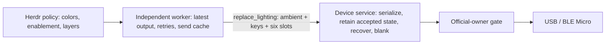

# Codex Micro bridge

## Current architecture

The integration has one device service and one optional Herdr policy client:

```text
stock Codex Micro firmware 0.6.2
  -> per-user dev.herdr.codex-micro LaunchAgent
     -> shared IOHIDManager transport: USB preferred, BLE supported
     -> lifecycle, official-writer gate, replay, reserved Handy action
     -> owner-only, exact-version typed Unix socket
  -> herdr-micro daemon (optional policy client)
     -> pushed herdr-hub model and call passthrough
     -> gestures, actions, and lighting policy
```

The complete lighting boundary keeps policy separate from device recovery:



The LaunchAgent runs without administrator privileges from
`~/Library/Application Support/dev.herdr.codex-micro/codex-micro`. It owns the
device connection, the official-writer gate, and reconnects. It closes the
physical device while Work Louder Input is running or ChatGPT/Codex desktop is
frontmost, then reopens and replays the latest state when that gate clears. USB
wins when USB and Bluetooth Low Energy are both available.

The local socket is mode `0600`, verifies the peer's effective UID, requires an
exact protocol version (2), bounds frames, and permits one device controller. Its
operations are typed: status, controller lifecycle, focused app, lighting, and
guarded keymap reads/writes. There is no generic raw device RPC and no path to
the device that bypasses the service. The physical-device gate is
service-owned.

`herdr-micro` is a client of that service and of `herdr-hub`. The hub publishes
the active Herdr session from `session.snapshot.client_focused`. The bridge
freezes and revalidates action targets, handles gestures, and computes
lighting. Stopping the hub blanks Herdr lighting and routing without stopping
the device LaunchAgent.

## Device ownership

The service uses shared, unprivileged IOHIDManager access. It does not seize
the USB interface, detach a macOS driver, install a root helper, or require
`sudo`. macOS Input Monitoring must be granted to the stable installed service:

```sh
herdr plugin action invoke service-authorize \
  --plugin gjermundgaraba.herdr-micro
```

Fresh-install behavior, Input Monitoring troubleshooting, and code-signing
notes are in the [README install section](../README.md#install).

The proprietary vendor channel still has a strict one-writer boundary. Work
Louder Input, the Codex desktop device writer, and this service are mutually
exclusive. The service and Herdr may both read the shared `external_owner()`
detector, but only the service enforces the gate by closing and reopening its
physical connection. Herdr uses that state only to suppress routing. Quit the
official writer for keymap setup; normal operation is gated automatically.
This is process coordination, not USB capture.

The service-owned device gate is:

| Owner state | Service result |
|---|---|
| Work Louder Input running | Close the physical device |
| ChatGPT/Codex desktop frontmost | Close the physical device |
| Official writer inactive | Open USB or BLE and replay desired state |

Separately, Herdr selects Layer 2 when the hub publishes an active Herdr
session and routes actions there. When the hub publishes no active session,
the bridge preserves the last applicable Herdr layer and dispatches no Herdr
action.

Layer 2 keeps `KV_OAI_AG00` through `KV_OAI_AG05` for six-way status lighting
and native action codes for configured controls. `micro-setup` accepts only a
blank or previously managed Layer 2, backs up the complete keymap, writes it
through the typed service operation, and verifies read-back.

## Reserved Handy action

Button 5 is the physical `ACT10` switch. It is permanently reserved by the
device service and must remain `null` in Herdr's `config.json`. On press, the
service consumes the event and runs Handy's `--toggle-transcription` command
directly.

This path has no F19 mapping and emits no CGEvent. It remains available
without a running Herdr session and does not depend on permission to synthesize
keyboard events. macOS can still temporarily deny access to the physical HID
keyboard during Secure Input or console ownership changes; this affects every
device button, including Handy. The service reports the access denial and
retries automatically. The other buttons, dial, joystick, gestures,
routing, and lighting policy remain Herdr-side. The stock wide keycap can
actuate both Button 5 and Button 6, so Button 6 is `null` by default.

## Herdr action scheduling

One hub subscription supplies all session, agent, and active-session changes;
the bridge does not poll Herdr. Built-in actions use the hub call passthrough.
Routing updates never wait for device I/O. A separate worker retains only the
latest desired layer and lighting, compares actual light values, and writes
only changes. Terminal-title animations and other agent metadata do not resend
lights. Device errors are reported separately from Herdr routing failures.
Lighting uses `Client::replace_lighting` with a complete snapshot: `ambient`,
`keys`, and exactly six slots. Every replacement writes both aggregate zones
and all slots; disabled aggregates and `Lighting::default()` explicitly turn
lights off. Success means the service accepted the snapshot: connected device
writes completed under the transport contract, or an offline snapshot was
retained for replay. It does not promise visible hardware read-back.

A failed write can have partial physical effects. The service retains its last
accepted snapshot and replays it after reconnect, or blanks all lights if none
was accepted. Official-owner checks remain between writes and gate recovery.
The first controller acquisition after service restart establishes native
Layer 1 and complete blank lighting, including when a status check already
opened the device. Status queries alone do not reset lighting. Controller
disconnect restores Layer 1 and blanks every supported surface. The worker
invalidates its send cache before a lighting attempt so a lost IPC reply cannot
prevent a later replacement. Version 1 clients and services are rejected;
update both binaries together using the start flow above.

Before a queued binding runs, its captured session key must still match the
hub's current active route, and `agent.get` must return the captured terminal,
pane, and agent identity with
`focused == true`; an Agent-key focus checks the captured identity without
requiring it to already be focused.

Script actions run from the plugin root after the same session, pane, agent,
and routing generation are revalidated. A script also requires a local session
socket; remote hub sessions refuse script actions.

Scripts receive `HERDR_SOCKET_PATH`, `HERDR_SESSION`, and `HERDR_PANE_ID`, and
inherit `HERDR_BIN_PATH`. Output is bounded. One worker runs accepted scripts
in FIFO order, with a queue of 16 and a five-second deadline.

## Compatibility and limitations

| Component | Current boundary |
|---|---|
| Platform | macOS only |
| Herdr | A build with `session.snapshot.client_focused`, with `herdr-hub` running |
| Build toolchain | Rust 1.89 or newer |
| Codex Micro firmware | Stock 0.6.2 baseline; USB `device.status` physically confirmed |
| Device transport | USB preferred; Bluetooth Low Energy supported |
| Effort control | Codex CLI, Claude Code, and Pi with the bundled extension |

- The OAI HID protocol is proprietary and unsupported. Work Louder publishes
  firmware binaries, not a third-party SDK or writer-coordination contract.
- The current 0.6.2 confirmation is a USB status probe. Physical validation of
  the complete new service path and 0.6.2 BLE path is recorded separately when
  performed; the [research record](research/README.md) distinguishes it from
  older evidence.
- Only the six Agent keys are independently addressable for lighting on the
  tested Micro. Lower-key backlight and perimeter lighting are aggregate zones.
- Aggregate-zone synchronization flags have not been physically verified.
- Claude effort changes require an empty prompt. Existing Pi sessions need
  `/reload`; effort changes affect later requests, not one already in flight.

## Thinking-effort control

The Herdr client freezes the focused agent and pane before sending:

| Agent | Mechanism |
|---|---|
| Codex | Bundled adapter sends the CLI defaults `alt+.` and `alt+,` |
| Claude | The adapter drives `/effort`, one step left or right |
| Pi | The adapter sends the bundled extension shortcut |

Install the Pi extension with `bin/herdr-micro setup-pi-effort`; existing
sessions need `/reload`. Codex CLI bindings come from `~/.codex/config.toml`,
not Codex Desktop's `~/.codex/keybindings.json`.

## Lifecycle

`bin/herdr-micro start` installs or refreshes the per-user LaunchAgent before
starting the Herdr client. The service is supervised independently and keeps
the reserved Handy action available without Herdr whenever its official-writer
gate is clear. `micro-stop` stops only the Herdr routing client; the service
continues owning its physical-device gate.

Before unlinking or uninstalling the plugin, remove the service while its
source binary still exists:

```sh
bin/codex-micro uninstall
```

This boots out `dev.herdr.codex-micro` and removes its LaunchAgent, installed
executable, and installation directory. It requires no administrator access.
